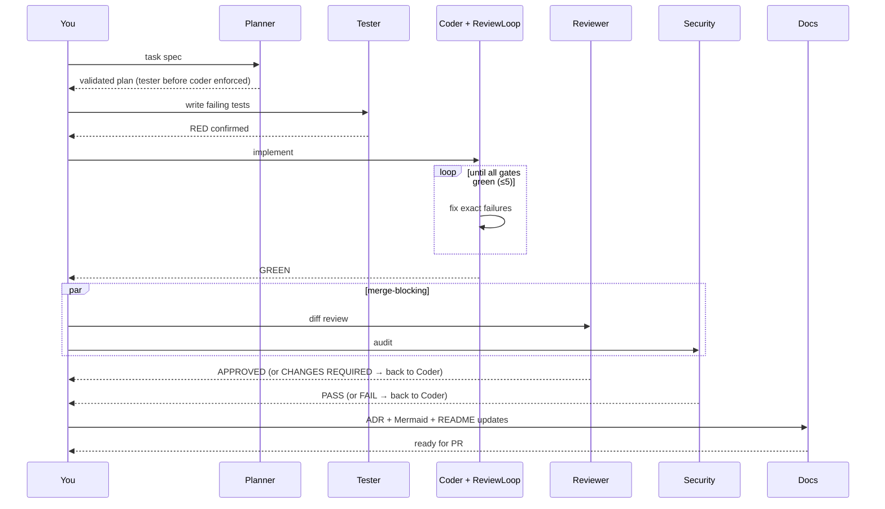

# Developer Guide — JD Bank (on Agent Harness v2)

> From `git clone` to your first agent-built feature merged to `main`. Offline-first Python
> stack (FastAPI · **Neo4j** · Postgres · Redis · arq · Flask) driven by AI subagents through
> Claude Code (or Codex / Copilot). **Everything runs in Docker — there is no host Python.**
>
> This guide is also the **golden-standard template** for new projects on this harness
> (see §13). JD Bank is the reference implementation.

**Read first:** root `CLAUDE.md` (project invariants), `docs/plan.md` (build plan), and the
ADRs — especially **ADR-002** (Neo4j=vectors/Postgres=SQL), **ADR-003** (offline Ollama),
and **ADR-006** (Docker-only execution). This guide operationalizes them.

---

## Table of Contents

1. [Prerequisites](#1-prerequisites)
2. [Clone and bootstrap](#2-clone-and-bootstrap)
3. [First-run verification](#3-first-run-verification)
4. [Pick your AI harness](#4-pick-your-ai-harness)
5. [Your first feature — end-to-end walkthrough](#5-your-first-feature--end-to-end-walkthrough)
6. [The subagent pipeline in practice](#6-the-subagent-pipeline-in-practice)
7. [The gate suite — what actually blocks you](#7-the-gate-suite--what-actually-blocks-you)
8. [Working with graph memory](#8-working-with-graph-memory)
9. [Async jobs and the Flask dashboard](#9-async-jobs-and-the-flask-dashboard)
10. [Extending the harness](#10-extending-the-harness)
11. [Troubleshooting](#11-troubleshooting)
12. [Team conventions](#12-team-conventions)
13. [Golden standard — reusing this for new projects](#13-golden-standard--reusing-this-for-new-projects)

---

## 1. Prerequisites

**Docker-only rule (ADR-006): no host language runtimes or compilers.** You do **not** install
Python, pip, venv, or the `pre-commit` framework on the host. All project code, tests, linters,
and the type-checker run inside containers.

Install on the host (metal):

| Tool | Version | Why |
|---|---|---|
| Git | ≥ 2.40 | Branch workflow |
| Docker + Compose | Docker 24+, Compose v2 | Runs **everything** (app, tests, gates, tooling) |
| **Ollama** | latest | Inference — the ONLY non-Docker runtime; must run on host for GPU/Metal (ADR-003) |
| Node (optional) | 20+ | Only if you install the Claude Code CLI |
| `make` (optional) | any | Convenience task-runner that *invokes* Docker; commands also work raw |

`make` is not a code runtime — it just shells out to `docker compose`. If it's not installed
(common on Windows), use the raw `docker compose …` commands shown alongside each target.

Pull models once (on the host, into Ollama):

```bash
ollama pull qwen2.5-coder:14b     # AGENT_MODEL — the coding model in settings
ollama pull nomic-embed-text      # 768-dim embeddings matching the Neo4j vector index
OLLAMA_HOST=0.0.0.0 ollama serve &   # bind all interfaces so containers can reach it
```

Verify: `curl -s http://localhost:11434/v1/models | jq '.data[].id'` should list both.

Neo4j Browser is at `http://localhost:7474` once the stack is up (creds `neo4j` / `harnesspass`).

---

## 2. Clone and bootstrap

No venv, no `pip install` — the image already contains every Python dependency
(`core/requirements.txt` + `requirements-dev.txt`), and `./core` is bind-mounted into the
containers, so host edits take effect with no rebuild.

```bash
git clone <your-repo-url> JD-Assistant
cd JD-Assistant

cp .env.example .env               # edit only to override defaults

docker compose up -d               # build + start the stack (Ollama must be running on host)
make migrate                       # or: see the migrate recipe in the Makefile
make hook-install                  # Docker-only git pre-commit hook (branch gate + gates-fast)
```

`docker compose up -d` starts: `postgres`, `neo4j`, `redis`, `api` (FastAPI :8000),
`worker` (arq), `frontend` (Flask :5000). Containers reach Ollama on the host via
`host.docker.internal:11434` — preconfigured with `extra_hosts: host-gateway` so it works on
Linux too, not just Docker Desktop.

> **Legacy `.doc` note (JD Bank):** the SFU archive includes ~4,600 binary Word `.doc` files
> that python-docx cannot read. The ingestion image must include **antiword** (or a LibreOffice
> headless converter). This is a Phase-1 Dockerfile addition — see `docs/plan.md` §1.3.

---

## 3. First-run verification

Run these in order — each proves one layer works. **Everything here is Docker-side.**

```bash
# 3.1 Services healthy
docker compose ps
# Every service should show "healthy" or "running" (frontend has no healthcheck)

# 3.2 API responds
curl -s http://localhost:8000/health          # {"status":"ok"}

# 3.3 Neo4j vector index exists (this is where JD vectors live — NOT pgvector)
docker compose exec neo4j cypher-shell -u neo4j -p harnesspass \
  "SHOW INDEXES YIELD name, type WHERE name='artifact_embeddings' RETURN name, type"
# Should list artifact_embeddings | VECTOR

# 3.4 Ollama reachable FROM INSIDE a container (the critical connectivity check)
docker compose exec api curl -s http://host.docker.internal:11434/v1/models | jq -r '.data[].id'
# Must list qwen2.5-coder:14b and nomic-embed-text. If this fails, agents cannot run (§11).

# 3.5 Gate suite — runs in the one-shot `gates` container (no host Python), incl. integration
make gates          # = docker compose run --rm gates sh -c '...'  (self-contained)
# Expect: ALL GATES GREEN — ruff, black, mypy, unit, integration, coverage ≥ 80%

# 3.6 Dashboard
#   open http://localhost:5000
```

If any step fails, stop and fix it before continuing.

---

## 4. Pick your AI harness

JD Bank is developed primarily with **Claude Code**, but all three tools drive the same Python
core. `make use-*` symlinks the tool's instruction file to the repo root so it's auto-discovered.

```bash
make use-claude       # symlinks CLAUDE.md → harness-claude-code/CLAUDE.md
make use-codex        # symlinks AGENTS.md → harness-codex/AGENTS.md
make use-copilot      # symlinks .github/copilot-instructions.md
```

### Claude Code (primary)

```bash
npm install -g @anthropic-ai/claude-code   # if not installed
cd JD-Assistant && claude
```

The six subagents in `harness-claude-code/.claude/agents/` (planner, tester, coder, reviewer,
security, docs) plus `.claude/settings.json` (blocks commits to `main`; auto-runs
`ruff --fix` **in the api container** after every write) are the harness's Claude Code layer.

> **Activation note:** to make those subagent definitions and hooks active for sessions run
> from the **repo root**, the `.claude/` directory must be at the root. Point it at the harness
> layer once: `ln -s harness-claude-code/.claude .claude` (or `make use-claude` + copy). Until
> then the defs are vendored but inert at root — confirm with `/agents` inside a session.

### Codex

Reads `AGENTS.md`; task files live in `harness-codex/.codex/tasks/*.task.md`.

### Copilot

VS Code + Copilot Agent Mode; instructions load from `.github/copilot-instructions.md`, skills
from `.github/copilot-instructions/`.

---

## 5. Your first feature — end-to-end walkthrough

Goal: **port the `ParsedJD` pydantic model (Phase 1.1)** — the contract every pipeline stage
speaks. It's the natural first slice: pure, well-specified, and a near-verbatim EXTRACT of
hris's `SFUJobDescription` (reuse map #1). Real JD Bank work, small enough for one sitting.

### 5.1 Create the agent branch

```bash
git checkout main && git pull
git checkout -b agent/T-p1-parsedjd-schema
```

Branch must match `(agent|feat|fix|chore)/<slug>` — the pre-commit hook (installed in §2)
rejects anything else.

### 5.2 Write a spec

```
Port hris `SFUJobDescription` (see docs/audit/hris-reuse-map.md #1) into
core/src/jd_core/models/parsed_jd.py as pydantic v2 models. 10 sections in order:
identification, position_summary, duties[SFUDuty(action_verb, statement, how_why)],
decision_making, problem_solving, relationships(supervisory/internal/external),
qualifications[SFUQualification(kind ∈ education|experience|knowledge|skill|ability|security,
modifier)], plus presence-booleans about_sfu / territorial_ack / employment_equity.
- Coerce JSON null → [] for list fields (LLM robustness), mirroring hris.
- Full type hints; mypy --strict clean.
- Unit tests: round-trip serialization + null-coercion + section ordering.
```

### 5.3 Run the pipeline (Claude Code)

```
Use the planner subagent to plan this task, then execute the full pipeline through docs.
```

Claude Code delegates `planner → tester → coder (inside the ReviewLoop) → reviewer + security
→ docs`. The pipeline halts if the reviewer rejects or security fails. (See §6.)

### 5.4 Verify before opening a PR — all in Docker

```bash
make gates          # must be entirely green (runs in the api container)
git log --oneline   # expect: red: ... → green: ... → docs: ...
```

### 5.5 Open the PR

```bash
git push -u origin agent/T-p1-parsedjd-schema
gh pr create --fill
```

CI re-runs every gate (same in-container commands). Green → merge to `main`. That's the loop.

---

## 6. The subagent pipeline in practice

This is the harness's core capability — use it for every non-trivial task.



Under the hood: `PlannerAgent` decomposes → `Orchestrator` topologically dispatches subagents,
passing prior outputs as context; the coder runs inside the iterate-until-green `ReviewLoop`;
**reviewer approval + security pass are merge-blocking** (`core/src/agents/orchestrator.py`).
The whole run is the `run_pipeline` arq job and is recorded to the Neo4j lineage graph.

**When each subagent triggers**

- **Planner** — always first for anything non-trivial. Skip only for one-line fixes.
- **Tester** — always before Coder. The urge to skip is the signal you need it.
- **Coder** — inside the ReviewLoop (max 5 iterations). On escalation, read the failure report;
  the fix is usually a mis-scoped test or an ambiguous spec.
- **Reviewer** — always after Coder, before merge. Approval is blocking.
- **Security** — auth, input handling, secrets, file writes, subprocess, network egress. For
  JD Bank, also: any code touching JD content must respect local-first (no cloud calls).
- **Docs** — always last, after Reviewer approves. Updates ADRs + Mermaid + README.

**Reading pipeline output** — the worker returns a structured per-subtask result; the Flask
dashboard shows run lineage; Neo4j Browser (`:7474`) shows the graph:

```cypher
MATCH (t:Task)-[:DECOMPOSED_INTO]->(s:Subtask)-[:EXECUTED_BY]->(a:Agent)
OPTIONAL MATCH (s)-[:PRODUCED]->(ar:Artifact)
RETURN t, s, a, ar LIMIT 25
```

---

## 7. The gate suite — what actually blocks you

**All gates run inside Docker (ADR-006) — including integration. Testing is non-negotiable and
has no host fallback.** The full suite runs in a dedicated one-shot `gates` compose service:

```bash
make gates          # full: ruff · black · mypy --strict · unit(cov ≥ 80) · integration
make gates-fast     # subset: static + unit (no integration) — the quick edit-loop gate
```

Both are just `docker compose run --rm gates sh -c '…'`. The `gates` service (defined in
`docker-compose.yml`, `profile: tools`) carries everything the suite needs, so `make gates` is
**self-contained — you do not need `make up` first**: unit/static need no services, and the
**integration tests spin their own Postgres + Neo4j via testcontainers**. That works in Docker
because the `gates` service:

- mounts the Docker socket **in the compose file** (`/var/run/docker.sock`) — works identically
  on Linux and Docker Desktop (Windows/macOS), no host-path juggling;
- sets `TESTCONTAINERS_HOST_OVERRIDE=host.docker.internal` so the sibling test containers are
  reachable via the host gateway;
- sets `TESTCONTAINERS_RYUK_DISABLED=true` (the reaper is unreliable in Docker-in-Docker).

Run just the integration slice with `make gates-integration`. **CI runs the identical
`docker compose run --rm gates` command** — local and CI are byte-for-byte the same.

Enforced in three places: **pre-commit hook** (`gates-fast`, Docker) → **the ReviewLoop**
(gates run after Coder; failures feed back ≤5×) → **CI** (`.github/workflows/ci.yml`, same
`gates` service; `main` requires green).

**When a gate is red, iterate on that exact failure only.** Never: weaken/delete a failing
test, add `# type: ignore` without a justification, lower the coverage floor in
`pyproject.toml`, or comment a gate out. After 5 ReviewLoop iterations still red → the subagent
escalates with the full report. Read it; fix the spec or the test, never the gate.

---

## 8. Working with graph memory

Before implementing anything, check whether similar work already exists — the JD Bank
`/memory-query` discipline. Vectors live in **Neo4j** (ADR-002), not pgvector.

```bash
curl -s "http://localhost:8000/memory/similar?q=parsedjd%20schema&k=5" | jq
```

Subagents call this automatically via `_memory_context()` in `core/src/agents/base.py` before
completion. Task lineage:

```bash
curl -s "http://localhost:8000/tasks/<uuid>/lineage" | jq
```

Neo4j Browser (`:7474`, neo4j/harnesspass):

```cypher
MATCH (t:Task)-[:DECOMPOSED_INTO]->(s:Subtask)-[:EXECUTED_BY]->(a:Agent)
OPTIONAL MATCH (s)-[:PRODUCED]->(ar:Artifact)
RETURN t.id, s.description, a.id, collect(ar.id) ORDER BY t.id DESC LIMIT 5
```

Memory is a corpus that compounds. Don't clear it unless you're testing. (JD *document*
embeddings — Phase 3 — also live in Neo4j's vector index, distinct from this agent-memory graph.)

---

## 9. Async jobs and the Flask dashboard

Enqueue a task from the dashboard (`http://localhost:5000`) → it POSTs `/tasks`, which writes a
`Task` row (Postgres), generates the `agent/<uuid8>-<slug>` branch, and enqueues `run_pipeline`
on arq. Watch it:

```bash
docker compose logs -f worker      # subagent transitions logged in order
```

From code (run inside a container, e.g. `make shell`):

```python
import httpx
r = httpx.post("http://api:8000/tasks", json={"title": "...", "spec": "...acceptance criteria..."})
print(r.json())
```

On-demand gates for a branch: `curl -s -X POST "http://localhost:8000/gates/run?branch=agent/T-42-slug" | jq`.

---

## 10. Extending the harness

**Add a subagent** (e.g. a JD Bank `RulebookAgent` that checks rulebook-as-data invariants):
1. `core/src/agents/rulebook.py` extends `BaseAgent`; `agent_id = "rulebook"`.
2. Add to `VALID_AGENTS` in `planner.py`; register in `Orchestrator._agents`.
3. If merge-blocking, add the check in `Orchestrator.run` alongside reviewer/security.
4. Claude Code: `harness-claude-code/.claude/agents/rulebook.md` (YAML frontmatter).
   Codex: role in `AGENTS.md`. Copilot: `.github/copilot-instructions/rulebook-skill.md`.
5. Unit-test the agent + orchestrator dispatch + planner acceptance.

**Add a gate** (e.g. `bandit`): add to `GATE_COMMANDS` in `core/src/gates/runner.py`, to the
`make gates` script (a `bandit …` line in the `gates`-service command), and to CI. Keep it
Docker-side — it runs in the `gates` service like every other gate.

**Add a store** — think twice. Postgres for transactions/relational, **Neo4j for graph +
vectors** (no pgvector — ADR-002), Redis for the queue. A fourth store needs an ADR + security
review (offline egress rule).

**Change the coding model** — edit `AGENT_MODEL` in `.env`; everything follows (OpenAI-compatible
client → Ollama). Re-run the full suite against a new model before defaulting to it.

---

## 11. Troubleshooting

**"python: command not found" / trying to `pip install` on the host** — that's the Docker-only
rule working as intended (ADR-006). Run tooling via `docker compose exec -T api …` or `make shell`.

**Ollama unreachable from containers** — `docker compose exec api curl http://host.docker.internal:11434/v1/models`
fails. Ensure `OLLAMA_HOST=0.0.0.0 ollama serve` and Docker 24+ (`host-gateway`). macOS/Windows
Docker Desktop Just Works.

**Neo4j vector index missing** — `similar_artifacts` errors "no such index". Re-run `make migrate`.

**Integration tests can't reach testcontainers** — the runner needs the Docker socket + host
override (§7). Check the socket path for your OS. Confirm `docker ps` works as your user.

**Gates green locally but red in CI** — usually the branch-name gate (CI checks
`GITHUB_HEAD_REF`) or integration networking. Read the CI logs before assuming code is wrong.

**Legacy `.doc` won't parse** — python-docx only reads `.docx`. Binary `.doc` needs antiword /
LibreOffice in the ingestion image (Phase 1.3). See the census, `docs/audit/archive-census.md`.

**Subagent emits wrong file-block format** — agents parse ```` ```python path=src/foo.py ````.
Use `qwen2.5-coder:14b` (tested) or adjust the agent's `_extract_*` regex.

---

## 12. Team conventions

**Branch naming** (enforced): `agent/<task-id>-<slug>` for AI work; `feat|fix|chore/<slug>` for
human work; never commit to `main`.

**Commit messages** (convention): `red:` → `green:` → `refactor:` → `docs:`.

**PR checklist** (paste into the PR):
```
- [ ] All gates green in Docker (`make gates`)
- [ ] Coverage ≥ 80% maintained
- [ ] Reviewer subagent approved
- [ ] Security subagent passed (or N/A with justification)
- [ ] ADR added if architecture changed; Mermaid diagrams updated
```

**JD Bank invariants** (from root `CLAUDE.md` — do not violate):
- **Human approval:** canonical JDs are drafts until an HR reviewer approves. Nothing auto-publishes.
- **Rulebook as data:** gates/word-lists/verb-lists live in versioned YAML under `jd_core/rules/` — never hardcoded.
- **Validator as oracle:** LLM-touching tests assert validator post-state, never verbatim model text.
- **Local-first:** Ollama only; JD content never leaves the machine. Incumbent names are
  normalized out of *canonical* JDs as a **rulebook quality step** (job-not-person) — not a
  resume-grade privacy gate (these are JDs, not resumes).
- **Storage:** Neo4j = vectors + graph; Postgres = all SQL; Redis/arq = queue. **No pgvector.**
- **Fixtures are sacred:** `fixtures/golden/` + `fixtures/labels/` change only via reviewed PRs.

**ADR-worthy decisions**: new store, orchestration-semantics change, gate-suite change,
offline-inference boundary, public-API break, **or a change to the Docker-only boundary**.

---

## 13. Golden standard — reusing this for new projects

JD Bank is the **reference project** for this harness; the setup here is meant to be copied.
For a new project:

1. **Start from `C:\repos\agent-harnesses-v2`** (the live upstream harness) — it carries the
   Dockerized stack, the subagent pipeline (`core/src/agents/`), gates, memory, and the three
   tool layers. Vendor a copy per **ADR-004** (standalone repo adopting harness conventions).
2. **Adopt Docker-only from day one (ADR-006).** Use the Docker-delegating `Makefile` and the
   `.claude/settings.json` hook from this repo — they are project overrides that should flow
   **upstream** so the harness is Docker-only by default. Record each sync (ADR-004).
3. **Install a project `CLAUDE.md`** at the root with your invariants (see this repo's as a
   template); keep the vendored `harness-claude-code/CLAUDE.md` as the base rules.
4. **Write ADRs early** — repo placement, extract-vs-rewrite (if spinning off code), storage,
   Docker-only. Number project ADRs from 004+ (002/003 are inherited).
5. **Drive every feature through the subagent pipeline** and keep gates green. The gate suite
   *is* the definition of "done."

Deltas from upstream this project introduced (candidates to upstream): Docker-only `Makefile`
gates, Docker-delegating editor hook, `hook-install` git pre-commit, ADR-006. Keep them listed
so the golden standard converges.

---

## Quick reference

| Task | Command (Docker-only) |
|---|---|
| Start stack | `docker compose up -d` (or `make up`) |
| Full gates (incl. integration) | `make gates` → `docker compose run --rm gates …` |
| Fast gates (static + unit) | `make gates-fast` |
| Integration only | `make gates-integration` |
| Migrations | `make migrate` |
| Install git hook | `make hook-install` |
| Shell in container | `make shell` (`docker compose exec api bash`) |
| Switch harness | `make use-claude` / `use-codex` / `use-copilot` |
| Similar prior work | `curl "localhost:8000/memory/similar?q=..."` |
| Task lineage | `curl "localhost:8000/tasks/<id>/lineage"` |
| Worker logs | `docker compose logs -f worker` |
| Dashboard / Neo4j | `http://localhost:5000` / `http://localhost:7474` |
| Ollama on host | `OLLAMA_HOST=0.0.0.0 ollama serve` |

First PR: run the ParsedJD-schema task from §5 through the pipeline, merge it. Second PR:
Tier-1 exact-dup detection (Phase 3.1) — an early, quantified win over the archive.
