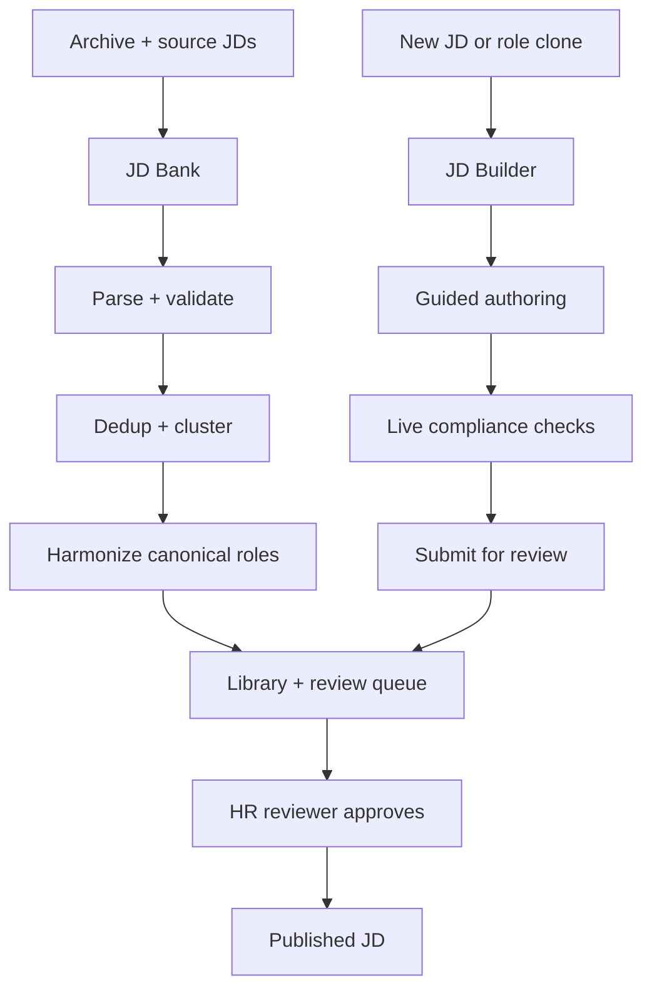
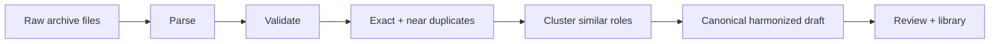
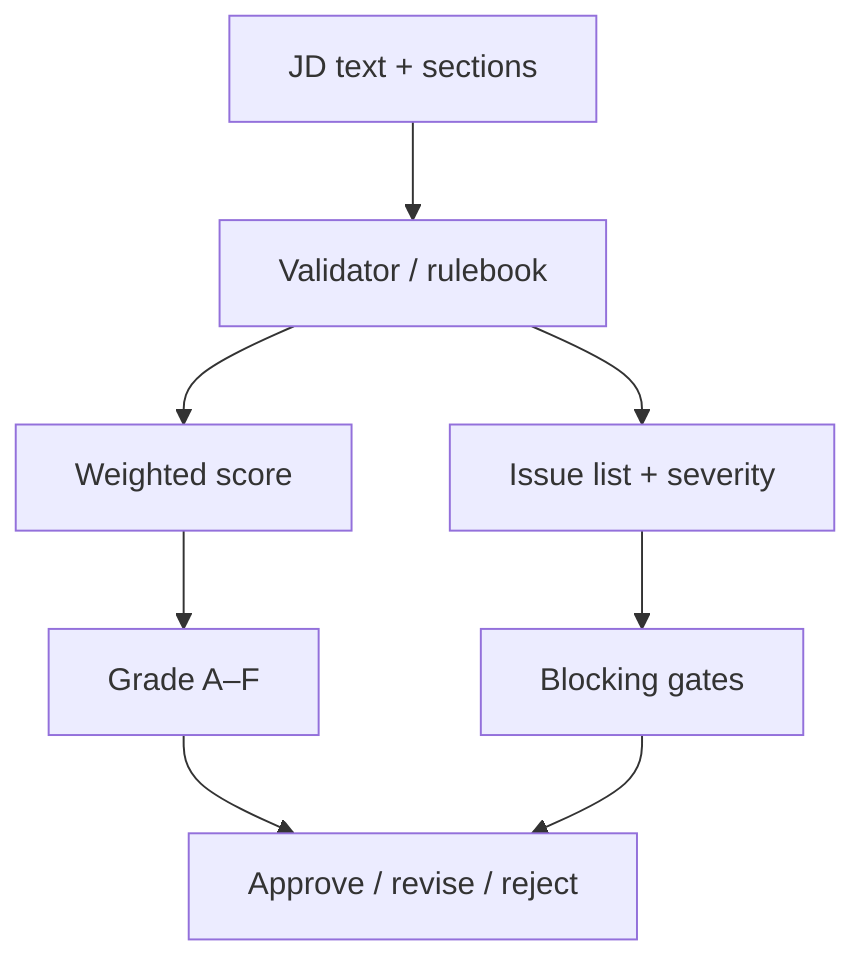
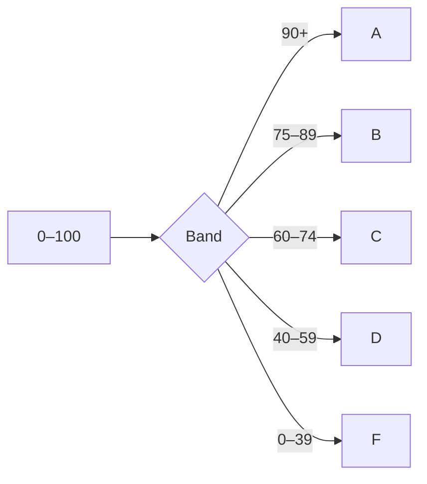
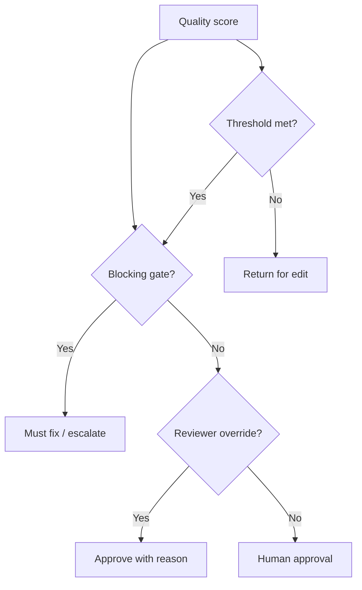

# JD Bank and JD Builder

## Executive summary

JD Bank is the archive and review engine. JD Builder is the guided authoring experience. Both are powered by the same rulebook and the same human-approval model.

## 1) JD Bank: archive intelligence

## 2) JD Builder: authoring support

## 3) Shared evaluation model

## 4) Grade bands

## 5) Approver lens

## 6) Key principle

The score helps describe quality. The gates determine whether approval is permitted. The reviewer remains the final authority.

> Nothing publishes automatically.

## 7) Final takeaway

JD Bank makes the archive usable and reviewable. JD Builder makes new JDs consistent with that standard. Together they create a single, explainable, HR-governed approval system.
