# JD Bank vs JD Builder

This project has two complementary capabilities:

- JD Bank is the archive and operating system for JD content: it ingests, deduplicates, clusters, harmonizes, and makes the library and review surfaces browsable.
- JD Builder is the authoring experience: it helps create a compliant JD from scratch or from a similar role, checks rulebook compliance live, and then routes a draft toward review without auto-publishing.

## 1) Big picture

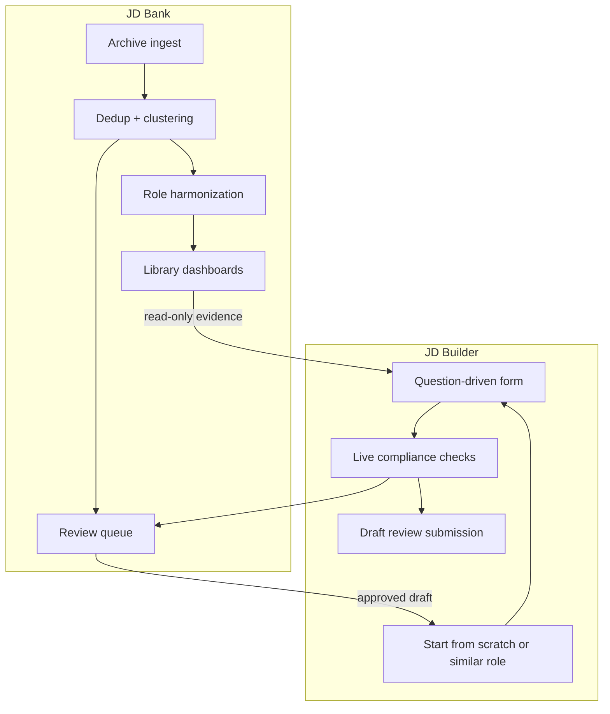

## 2) JD Bank: repository of the archive

JD Bank acts as the system of record for the SFU JD archive. It handles:

- ingest and normalization of source JDs
- deduplication, clustering, and role similarity search
- harmonization across related role variants
- dashboards for baseline, dedup, and clusters
- a review queue for human approval

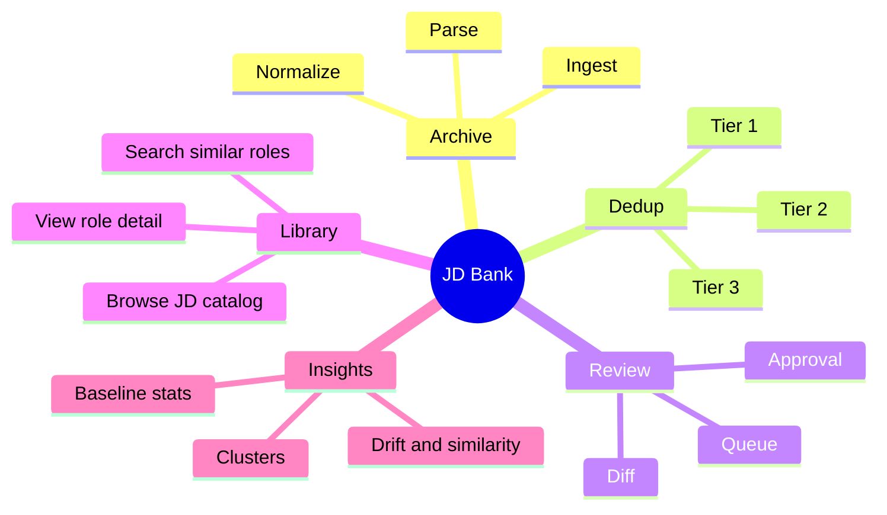

## 3) JD Bank workflow: validation, deduplication, and harmonization

JD Bank is not just a library. It is a rule-driven transformation pipeline that turns raw archive material into structured, comparable, reviewable job descriptions.

The key stages are:

1. ingest and parse source JDs
2. validate the JD against the official SFU rulebook
3. compute exact and near-duplicate relationships
4. cluster similar jobs into role families
5. harmonize related JDs into canonical drafts
6. publish the result to the library, review queue, and builder search

### 3.1 Validation: the gatekeeper

Validation is the first critical stage. It takes a parsed JD and scores it against structured policy data, without relying on a model decision. It examines:

- required sections and mandatory structure
- the summary length and summary quality
- duty count and duty allocation logic
- qualifications order and modifier vocabulary
- banned or placeholder phrasing
- title, grade, and employee-group signals
- severity-ranked issue records and approval gates

This is the layer that turns free-form JD text into a deterministic quality record.

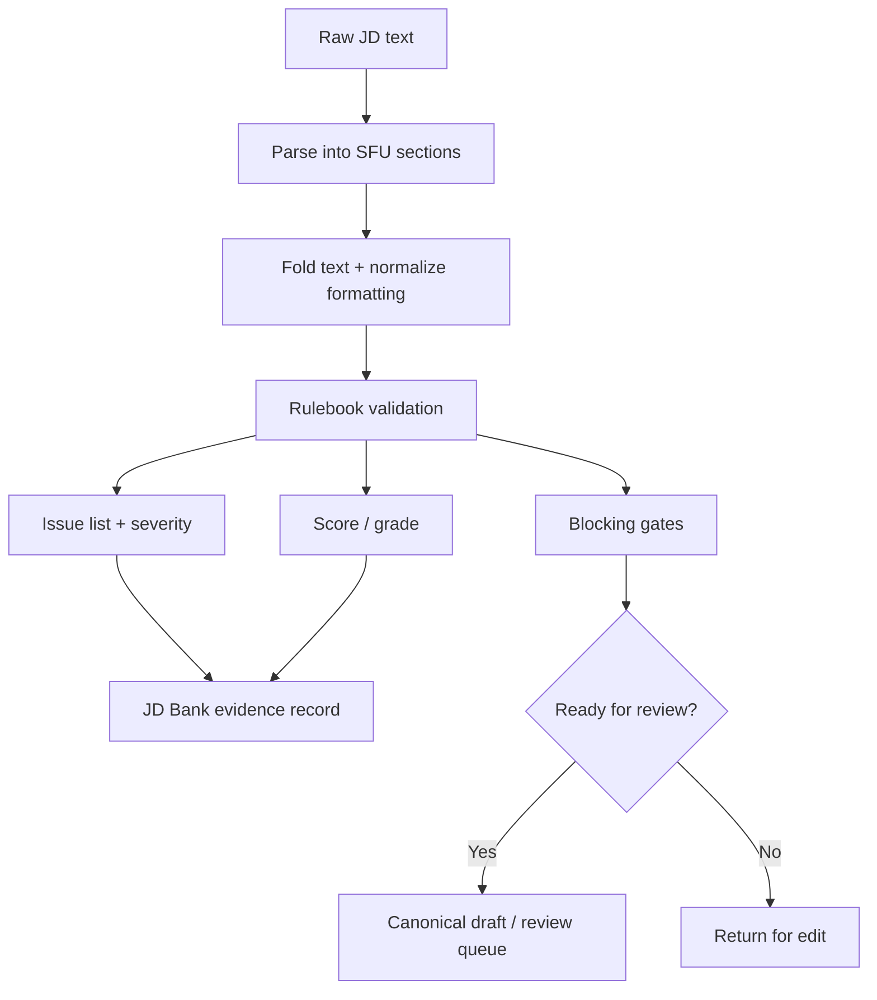

### 3.2 Deduplication: turning many near-identical JDs into one signal

Once JDs are parsed and validated, JD Bank asks: are two JDs the same role, or merely similar? The deduplication pipeline is layered.

- Tier 1: exact duplicate detection using strong content hashing
- Tier 2: near-duplicate detection using shingling and MinHash/Jaccard style comparison
- Tier 3: role-equivalence / semantic similarity using embeddings and similarity scoring

This is important because not every similar JD means the same role. The system tries to separate:

- exact duplicates
- near-duplicate variants of the same role
- different jobs with overlapping skills but different seniority or scope

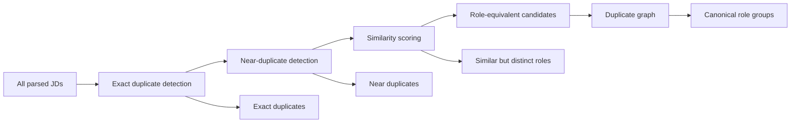

### 3.3 Cluster logic and comparison signals

Similarity data is not just used for matching; it is used to group JDs into role clusters. The comparison model uses a weighted score that can combine:

- summary embedding similarity
- skill overlap similarity
- seniority/education closeness
- title normalization to avoid artificially treating title variants as wholly different roles

This means the clustering layer is intentionally title-agnostic in the core metric and uses title only as a reporting signal.

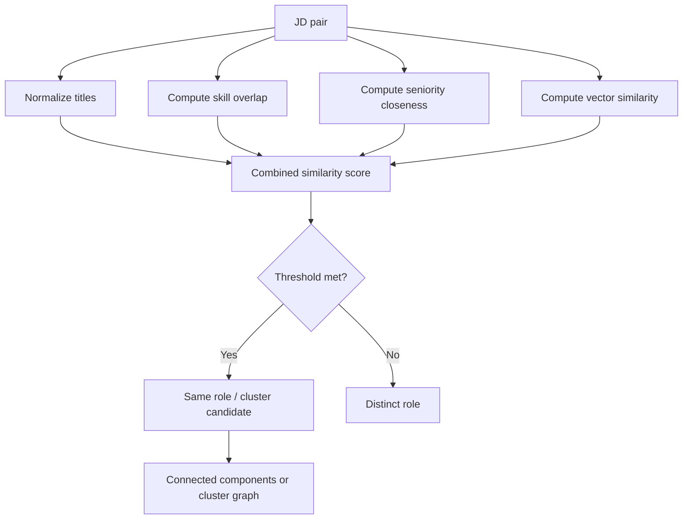

### 3.4 Harmonization: turning many role variants into one canonical draft

Once similar JDs are grouped, JD Bank can harmonize them. This is the stage where multiple versions of a role are combined into a single, cleaner canonical draft.

The harmonization process does not invent content. It selects and merges evidence from member JDs based on:

- the most representative title
- the strongest or most central summary
- preserved duty logic and qualification patterns
- cluster-level agreement for required skills and education bars
- dropping incidental context that is not shared or is noisy

This is where JD Bank moves from archive insight to a usable management artifact.

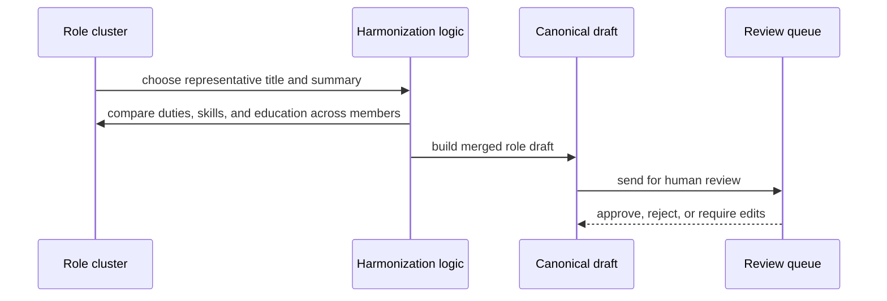

### 3.5 Rulebook-first architecture

The reason the JD Bank pipeline is trustworthy is that the logic is driven by data, not ad hoc code decisions.

The system reads structured policy inputs for:

- validation rules and severities
- thresholds and score bands
- deduplication noise floors and cluster cutoffs
- title normalization and similarity weighting
- harmonization decisions and review defaults

This makes the system explainable, auditable, and re-measurable. The rulebook remains the operational source of truth, while the code simply applies it.

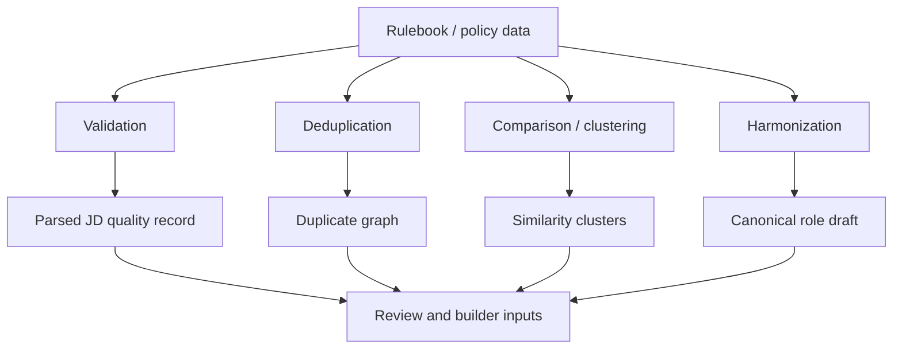

## 4) How the evaluation works: score, grade, and approval

The validator does not just flag text. It converts each rule violation into a measurable signal. That signal is then aggregated into a final quality outcome.

### 4.1 The basic flow

Each JD moves through the following evaluation path:

1. parse the document into sections
2. detect issues by rule type and severity
3. assign penalty points based on issue severity
4. compute a cumulative score out of 100
5. map the score to a grade band
6. check whether any blocking gate is triggered
7. decide whether the draft can be approved or sent back

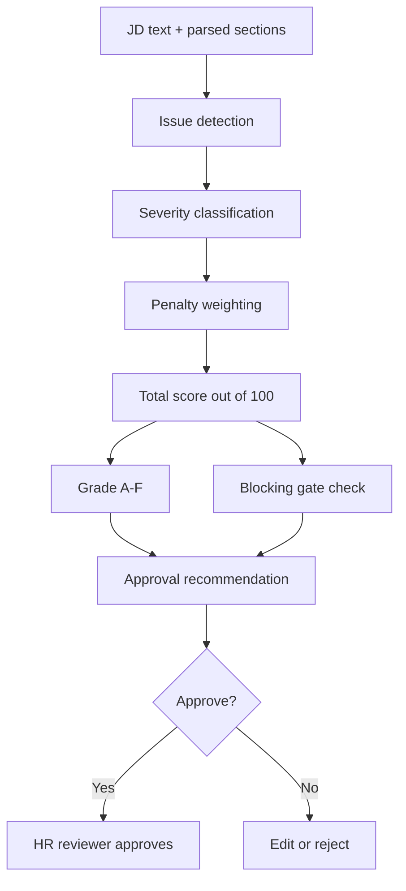

### 4.2 Severity and weighting

Rules are typically grouped by severity:

- high
- medium
- low
- info

Higher-severity problems carry heavier penalty weight. The total score is not based on one single issue; it is the aggregate of all detected rule failures, with a minimum score floor and a capped ceiling.

The practical rule is:

- a few low issues may reduce the score a little
- repeated or critical issues can drive the score below the approval threshold
- blocking issues may prevent approval regardless of the score

### 4.3 Grade bands

The grade is a coarse read of the score, usually expressed as:

- A: excellent and clearly compliant
- B: generally strong with minor issues
- C: acceptable but with visible gaps
- D: weak and needs significant revision
- F: falls far below acceptable standard

In other words, the grade is a human summary, while the issue list is the operational detail behind the rating.

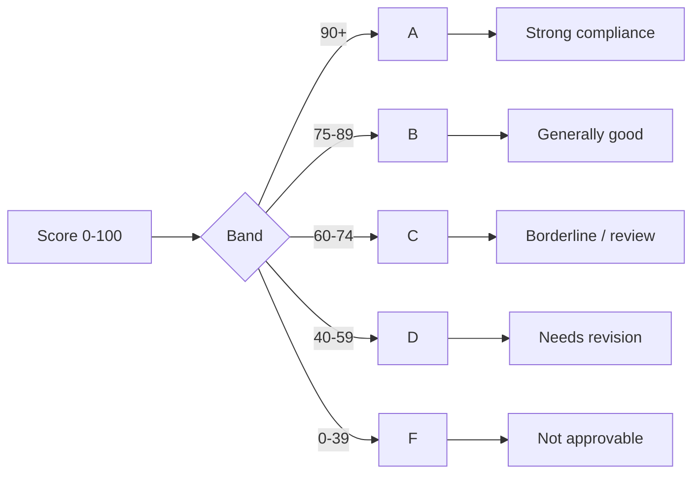

### 4.4 Approval gates and override logic

A JD may be blocked even when the total score is passable. This is the key governance principle:

- the score tells you how strong the job description is
- the gates tell you whether it is even eligible for approval
- the human reviewer remains the final decision-maker

Some rule violations are advisory only; others are hard blockers. Those blockers can be overridden by a reviewer only with a recorded reason, and some are never waivable.

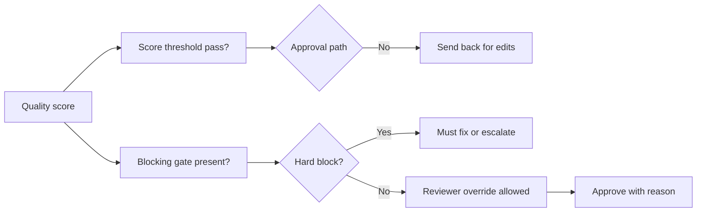

### 4.5 Why this matters for JD Bank and JD Builder

This same evaluation logic is used in both places:

- JD Bank uses it on the archive, on harmonized drafts, and on review packets
- JD Builder uses it live while the author is drafting
- both feed the same final human-approval decision

That ensures the same standards are applied whether the JD is being reviewed from the archive or authored from scratch.

## 5) JD Builder: authoring and compliance workflow

The JD Builder is a guided authoring surface. It captures structured duties, KSA rows, and other required JD fields, then checks the draft against the validator in real time.

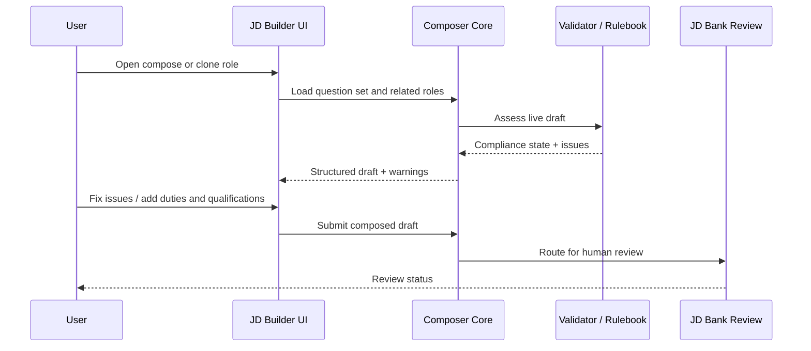

## 6) Quick comparison

| Area | JD Bank | JD Builder |
|---|---|---|
| Primary goal | Manage the archive and review corpus | Author a new or improved JD |
| Reads | Whole archive, role library, dashboards | Structured inputs and similar-role search |
| Writes | Review states and persisted records | Draft authoring and submission |
| User value | Discover, compare, and approve | Draft, validate, and improve |
| Best mental model | Archive + decision system | Guided authoring + compliance assistant |

## 7) Why both matter

| Area | JD Bank | JD Builder |
|---|---|---|
| Primary goal | Manage the archive and review corpus | Author a new or improved JD |
| Reads | Whole archive, role library, dashboards | Structured inputs and similar-role search |
| Writes | Review states and persisted records | Draft authoring and submission |
| User value | Discover, compare, and approve | Draft, validate, and improve |
| Best mental model | Archive + decision system | Guided authoring + compliance assistant |

## 6) Why both matter

The project is strongest when they work together:

- JD Bank gives the builder evidence from the archive and related roles.
- JD Builder turns that evidence into a draft that matches the SFU rulebook.
- The final review step keeps human approval as the last gate.

This keeps the system aligned with the project’s rule: nothing auto-publishes until a reviewer approves it.

| Area | JD Bank | JD Builder |
|---|---|---|
| Primary goal | Manage the archive and review corpus | Author a new or improved JD |
| Reads | Whole archive, role library, dashboards | Structured inputs and similar-role search |
| Writes | Review states and persisted records | Draft authoring and submission |
| User value | Discover, compare, and approve | Draft, validate, and improve |
| Best mental model | Archive + decision system | Guided authoring + compliance assistant |

## 5) Why both matter

The project is strongest when they work together:

- JD Bank gives the builder evidence from the archive and related roles.
- JD Builder turns that evidence into a draft that matches the SFU rulebook.
- The final review step keeps human approval as the last gate.

This keeps the system aligned with the project’s rule: nothing auto-publishes until a reviewer approves it.
