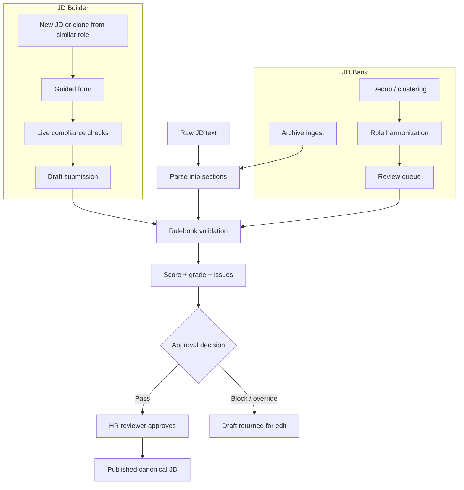
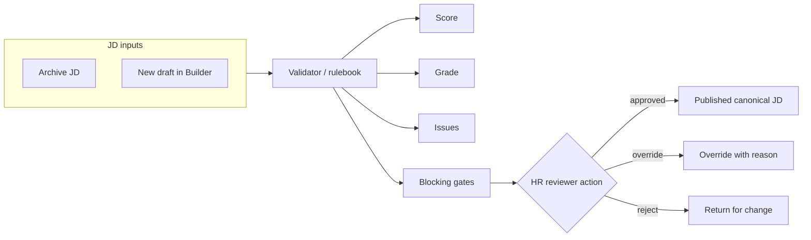
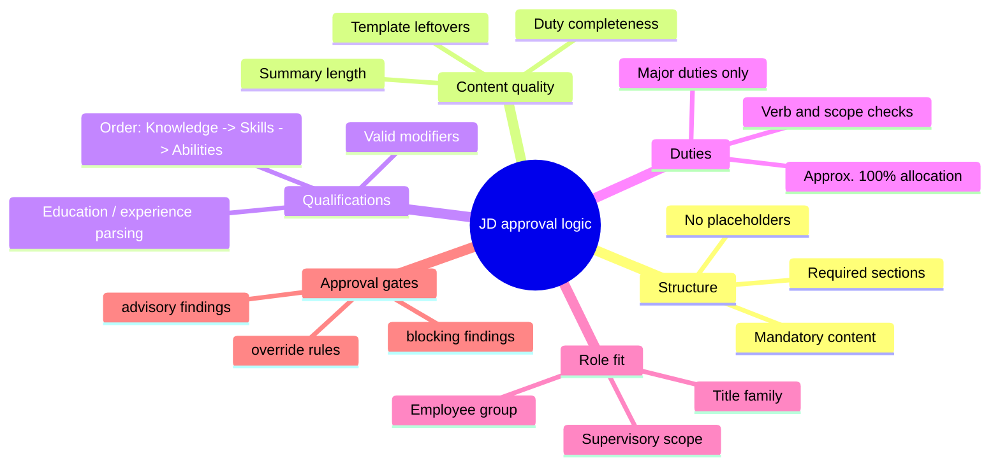
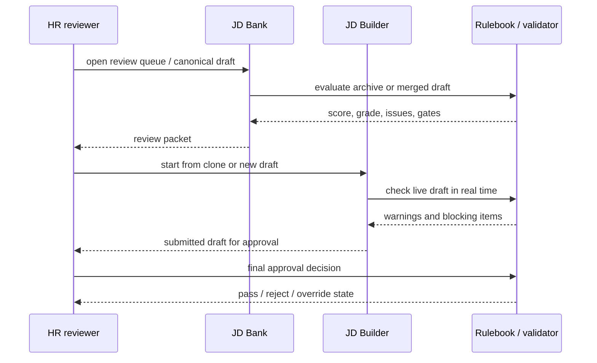

# JD Bank and JD Builder: HR Reviewer / Approver Explainer

This document explains how the same decision logic is used in both the JD Bank and the JD Builder, and what an HR reviewer should check before approving a JD.

## 1) The short version

The system has two main modes:

- JD Bank is the archive and review system. It ingests JDs, parses them, clusters and deduplicates similar roles, and exposes a review queue plus library dashboards.
- JD Builder is the authoring system. It helps a manager or recruiter draft a new JD or clone an existing role, and it checks the draft live against the same rulebook used by the review system.

In both cases, the same idea holds:

- raw JD text is converted into structured sections
- the validator checks those sections against the SFU rulebook
- the score, grade, issues, and blocking gates are computed deterministically
- a human reviewer approves or rejects the final JD

Nothing auto-publishes.

## 2) The shared approval model

The same validator is used across the archive and the builder. That is the most important design point for HR.

The rulebook is not hidden in prose or left to the model. It is data-driven, and it is used to produce:

- a quality score out of 100
- a grade band (A-F)
- a list of specific issues by section and severity
- a set of blocking approval gates
- optional reviewer override paths with a written reason

## 3) What the reviewer is actually judging

The reviewer does not simply ask, "Does this look good?" The reviewer is judging a structured rule set.

### Rule categories

1. Required structure
   - required sections must exist
   - placeholders are not acceptable
   - missing mandatory content can block approval

2. Content quality and clarity
   - summary length and wording
   - duty section logic and completeness
   - duplicates or template leftovers

3. Qualification quality
   - knowledge, skills, abilities must be in valid order
   - skill modifier levels must be valid
   - education and experience language must be interpretable

4. Duty logic
   - duties must be major responsibilities
   - allocations must total approximately 100%
   - action-verb checks and structure matter

5. Role and title signals
   - seniority, supervisory scope, title family, employee group, and department fit

6. Approval gates
   - some issues are advisory only
   - some are blocking, even if total score is acceptable
   - some can be overridden only with a written reason

## 4) The decision surface the reviewer should care about

This is the practical HR lens.

### A. Quality score and grade

The system computes a score out of 100 and a grade. This is useful, but it is not the entire decision.

- score floor may be a threshold
- grade may be a band signal
- some rule violations can block approval even when the score is high

In other words: the score helps, but the blocking gates are what keep a JD from being approved.

### B. Blocking gates

Some rules are hard blockers. These matter more than the aggregate score.

Examples include:

- missing mandatory sections
- required boilerplate or template-required content still absent
- placeholder text left in a draft
- a section that is structurally broken enough that the JD cannot be interpreted
- certain severe issues in the summary, duties, or qualifications

### C. Overrides

Most non-mandatory gates may be overridden by a reviewer with a reason, but the override still needs to be visible and attributable.

That means:

- the reviewer must justify the exception
- the reason is recorded with the review event
- the override is not silent or hidden

## 5) How JD Bank and JD Builder use the same rules

The two experiences share the same decision logic, but they surface it differently.

### JD Bank

JD Bank is the archive + review environment. It uses the validator to:

- review historical JDs
- identify issues in current archive material
- cluster and compare related job roles
- produce a canonical merged draft from multiple source JDs
- send final drafts to the review queue

### JD Builder

JD Builder uses the same validator in real time while the author is drafting:

- guided form captures duties, knowledge, skills, abilities, and summary content
- as the author types, the current draft is assessed against the rulebook
- the author sees warnings and blockers before submission
- the system then submits the draft to the same review process used by JD Bank

## 6) The most common reviewer checks

A reviewer should look for these first:

### Required section checks
- has the summary section been completed?
- are duties present and major?
- are qualifications in the right order and structure?
- are required boilerplate sections present or intentionally excluded?

### Duty completeness and logic
- do the duties read like actual major job responsibilities?
- are time allocations plausible and approximately totalled?
- does the wording align with the SFU standards?

### Qualifications logic
- do the qualifications flow from knowledge to skills to abilities?
- are modifiers valid and consistent?
- do the education and experience statements read like actual requirements rather than prose?

### Approval gate logic
- is the issue merely advisory or truly blocking?
- if a gate is waived, is the reviewer reason recorded?
- if the draft is still not compliant, is it returned for edit rather than approved?

## 7) The core principle for HR

The system is designed to support, not replace, human judgement.

The right mental model is:

- the validator is the evidence engine
- the reviewer is the final decision-maker
- the archive and builder both feed the same rulebook
- the approver can override only where policy allows, and must record the reason

This keeps review decisions grounded in the same standards across all JD creation and maintenance paths.

## 8) Bottom line

For HR review, the meaningful question is not only, "What is the score?" It is:

- Is the JD structurally complete?
- Does it follow the SFU template and language rules?
- Are the blocking gates respected?
- If there is an override, is the reason explicit and recorded?
- Is the draft consistent with the archive, the role family, and the rulebook?

That is the shared logic behind both JD Bank and JD Builder.
