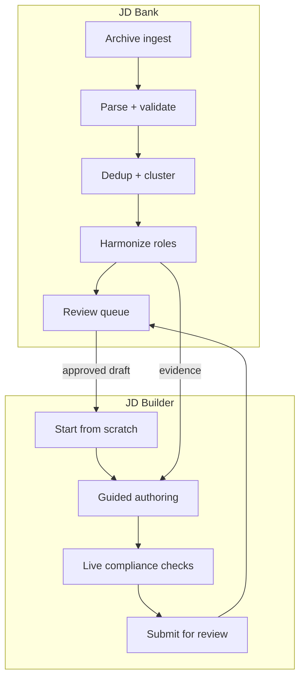
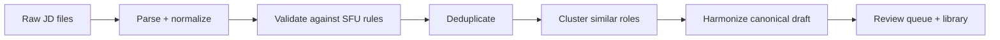
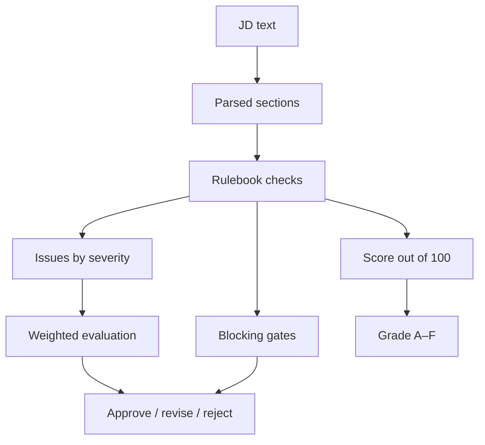
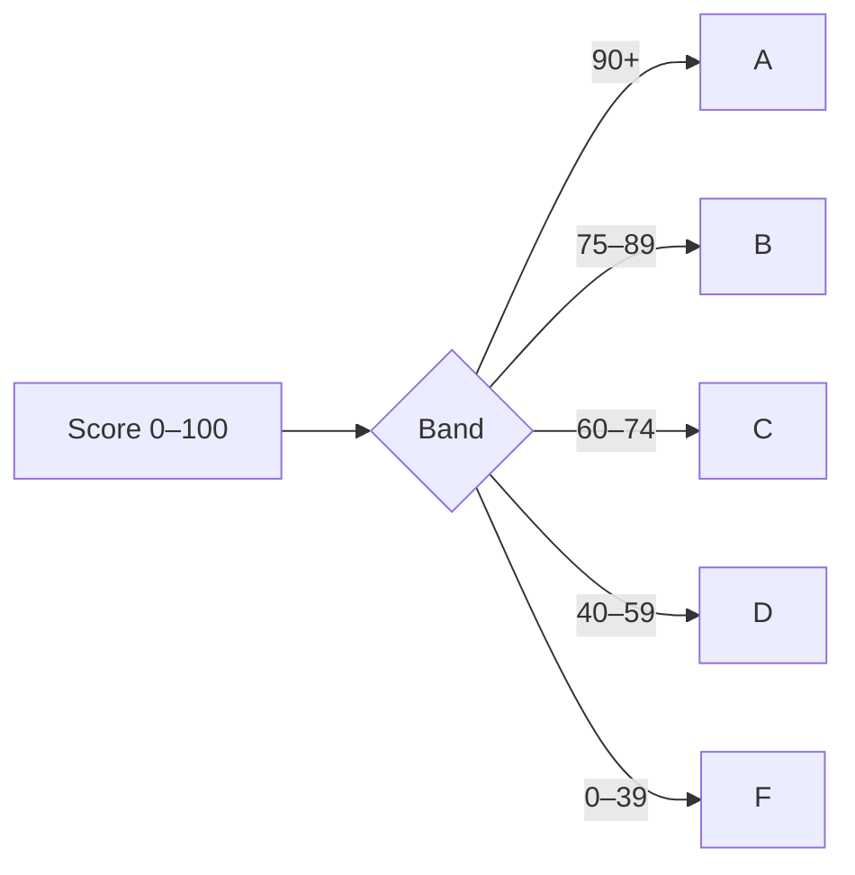
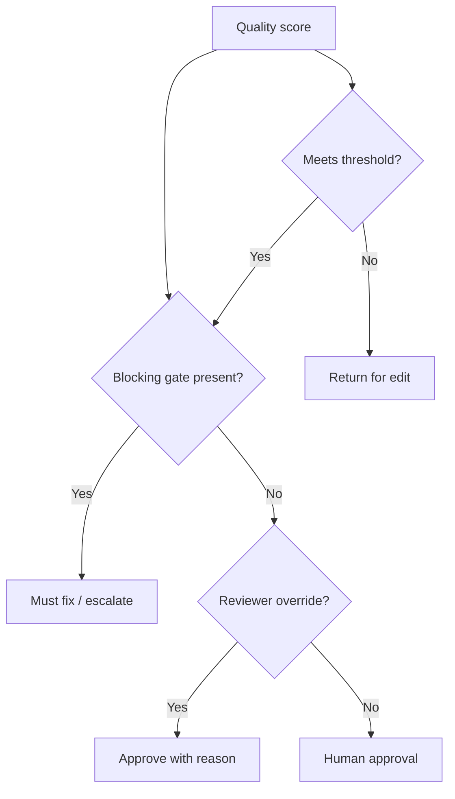

# JD Bank and JD Builder

## 1) Two pieces, one decision system

## 2) JD Bank: archive transformation

## 3) Validation: the decision engine

## 4) Grade logic

## 5) Approver view: score is not the whole story

## 6) Why both systems matter

- JD Bank converts the archive into standardized, comparable role evidence.
- JD Builder uses that evidence to draft a compliant JD in real time.
- Both feed the same approval model: rulebook, score, grade, gate checks, and human decision.
- Nothing auto-publishes.

## 7) Bottom line

JD Bank = archive intelligence and review infrastructure.
JD Builder = guided authoring and live compliance support.
Together they create a single accountable approval process for SFU job descriptions.
