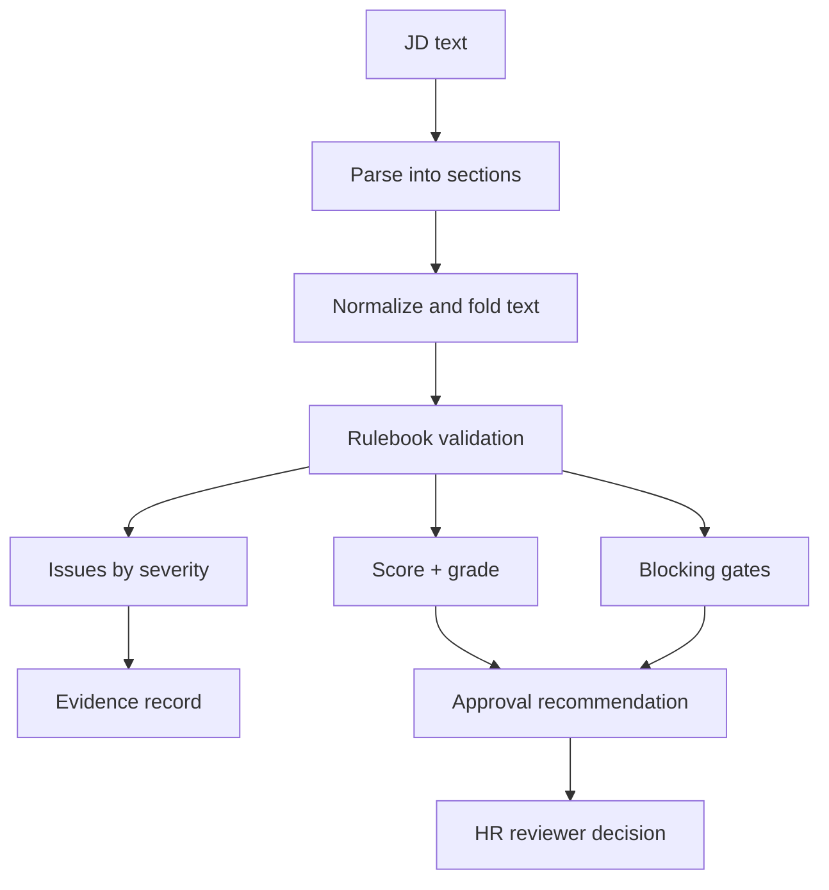
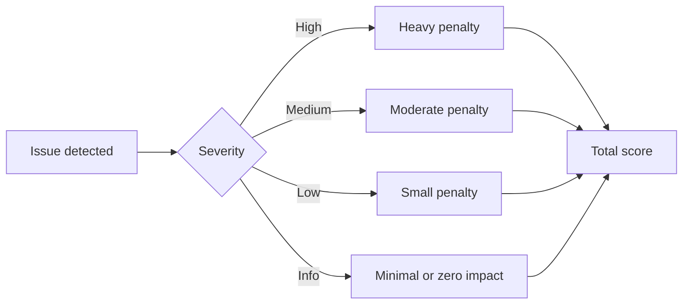
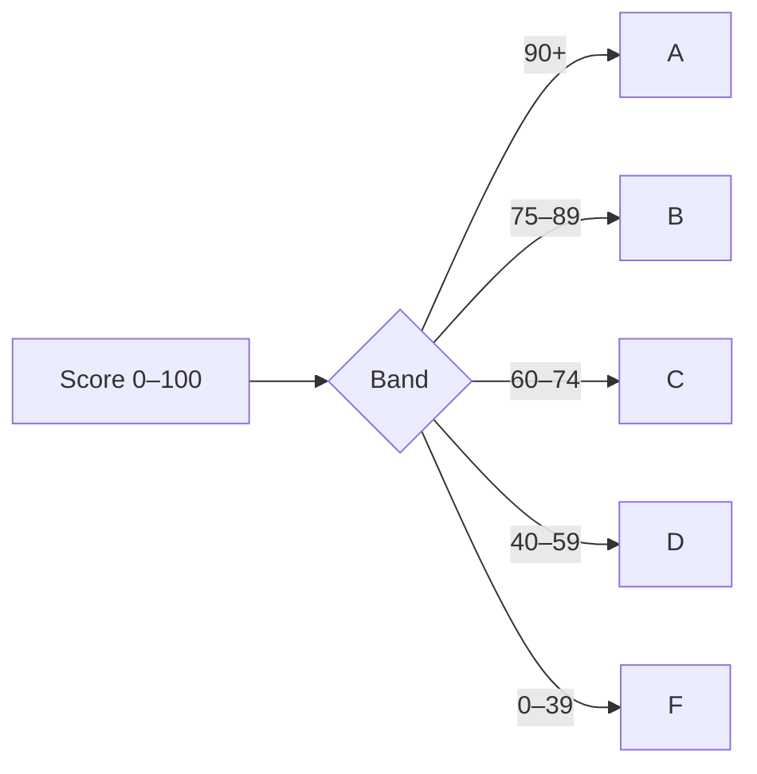
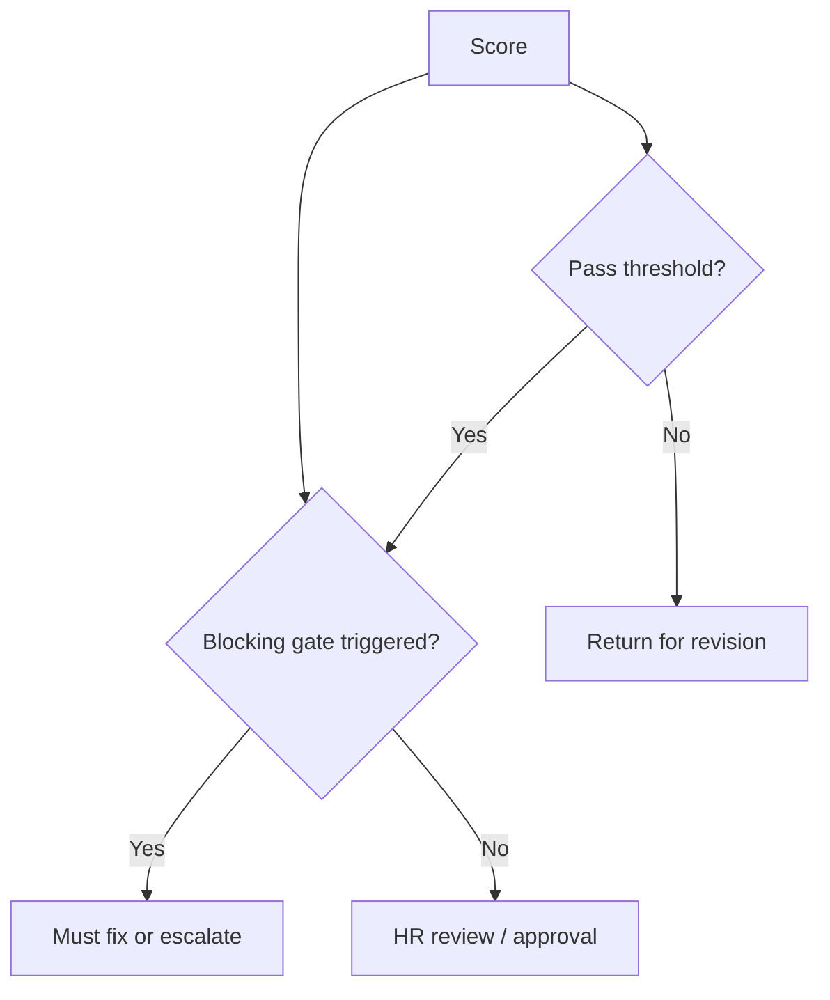
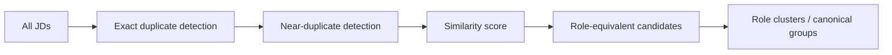
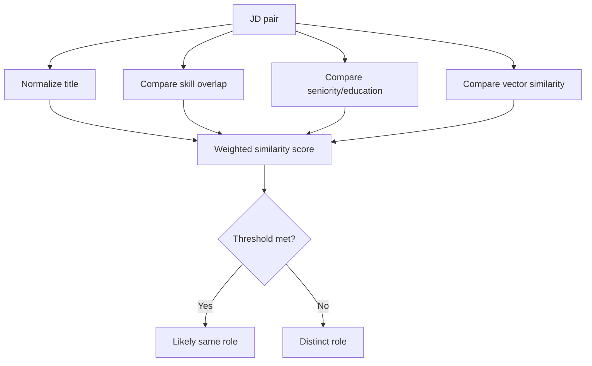
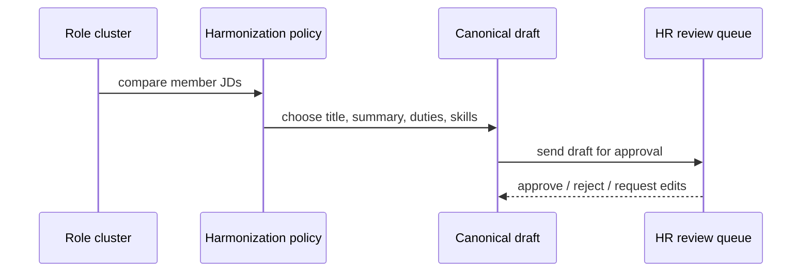

# SFU JD Rules, Metrics, and Dedupe Transparency

This document explains, in plain terms, how the JD Bank evaluates a JD, how it detects duplicate or near-duplicate roles, and how the operational rules are kept visible and reviewable.

## 1) The actual policy sources

This is not a vague policy narrative. The real defaults and rule IDs live in the repo and are checked by the build.

The authoritative files are:

- [core/src/jd_core/rules/gates.yaml](../core/src/jd_core/rules/gates.yaml) — the approval gates, fatal rules, score/grade filters, and override rules.
- [core/src/jd_core/rules/decision_register.yaml](../core/src/jd_core/rules/decision_register.yaml) — the HR decision register that records the default values and where they came from.
- [docs/decisions/HR-DECISION-REGISTER.md](../docs/decisions/HR-DECISION-REGISTER.md) — the generated human-readable view of the same decisions.
- [core/src/jd_core/rules/scoring.yaml](../core/src/jd_core/rules/scoring.yaml) — score scaling, severity penalties, and grade bands.
- [core/src/jd_core/rules/dedup.yaml](../core/src/jd_core/rules/dedup.yaml) — near-duplicate thresholds and text source rules.
- [core/src/jd_core/rules/comparison.yaml](../core/src/jd_core/rules/comparison.yaml) — similarity weights, clone threshold, cluster threshold, and drift-related defaults.

The project explicitly states that the rulebook is versioned data and that the generated register is drift-checked against the live values. In other words, this is not a prose interpretation; it is the machine-readable policy.

## 2) The core principle: rulebook-first evaluation

The system does not compute a JD score by intuition or model judgment alone. It evaluates the JD against a structured rulebook and then uses the result as the basis for score, grade, issue severity, and approval status.

The rulebook governs:

- required section structure
- summary length and summary quality
- duty count and duty allocation totals
- qualification order and modifier validity
- banned phrases and placeholder text
- employee-group, title, and seniority rules
- duplicate and similarity thresholds
- the metrics used to group roles and canonicalize them

This keeps the system transparent: the logic is not hidden inside a single model call or a single unexamined heuristic.

## 3) Actual rules and gate IDs in play

These are the concrete approval gates and defaults that are currently configured in the repo.

### 3.1 Approval gates

From [core/src/jd_core/rules/gates.yaml](../core/src/jd_core/rules/gates.yaml), the gate set includes blocking conditions such as:

- `SFU-APPROVE-MANDATORY-SECTIONS`
- `SFU-APPROVE-NO-PLACEHOLDERS`
- `SFU-APPROVE-DUTY-ALLOCATION`
- `SFU-APPROVE-QUAL-MINIMUM`
- `SFU-APPROVE-EDI-FOOTER`
- `SFU-APPROVE-SUMMARY-CONDITIONS`

These correspond to the decision register entries such as:

- `HR-001` — approval score floor
- `HR-002` — approval grade floor
- `HR-003` — severity floor
- `HR-004` — the “never approve if…” list
- `HR-005` — non-waivable gates

The generated register in [docs/decisions/HR-DECISION-REGISTER.md](../docs/decisions/HR-DECISION-REGISTER.md) explicitly records that the shipped defaults are open decisions, not ratified SFU policy.

### 3.2 Score and grade defaults

The scoring defaults are in [core/src/jd_core/rules/scoring.yaml](../core/src/jd_core/rules/scoring.yaml):

- `max_score: 100.0`
- `min_score: 0.0`
- `severity_penalty.high: 20.0`
- `severity_penalty.medium: 10.0`
- `severity_penalty.low: 5.0`
- `severity_penalty.info: 0.0`
- `severity_decay: 0.7`
- grade bands: `A >= 90`, `B >= 75`, `C >= 60`, `D >= 40`

Those values are also rendered in the decision register as `HR-008` through `HR-018`.

### 3.3 Deduplication defaults

The dedup policy is in [core/src/jd_core/rules/dedup.yaml](../core/src/jd_core/rules/dedup.yaml). Concrete shipped defaults include:

- `text_source: raw_clean`
- `shingle_size: 5`
- `min_shingles: 20`
- `num_perm: 128`
- `bands: 16`
- `rows: 8`
- `jaccard_min: 0.85`
- `edge_scope: content`

These are the actual numbers used in the candidate generation and edge-building process.

### 3.4 Similarity and clustering defaults

The similarity and cluster thresholds live in [core/src/jd_core/rules/comparison.yaml](../core/src/jd_core/rules/comparison.yaml):

- `weight_vector: 0.45`
- `weight_skill: 0.45`
- `weight_seniority: 0.10`
- `sim_threshold: 0.60`
- `clone_threshold: 0.92`
- `min_cluster_skill_overlap: 0.30`
- `exact_edge_topology: star`

Those are the values governing how similar two JDs are judged to be and when they may become a canonical cluster.

## 4) The metrics used in evaluation

The evaluation is based on a set of measurable signals. These are the main categories used in the model:

### 2.1 Structural checks
- required sections exist
- summary is present and within a target range
- duties are present and major responsibilities are clearly separated
- qualifications are in the expected order: knowledge → skills → abilities
- placeholders and template leftovers are not present

### 2.2 Content quality checks
- summary length and wording fit the SFU standard
- duties are meaningful, not filler or template text
- title looks consistent with the job family and employee group
- relationships, problem solving, and decision-making sections are present and readable

### 2.3 Severity-weighted scoring
- high-severity issues carry a larger penalty
- medium issues carry a moderate penalty
- low issues and informational items carry smaller or zero score impact

The idea is that a JD with serious structure problems should fail even if one or two minor quality issues are absent.

### 2.4 Grade bands

The score is mapped to grade bands so the rough quality level is visible to a reviewer.

- A: strong and compliant
- B: good and generally acceptable
- C: borderline but potentially approved with edits
- D: weak; substantial revision needed
- F: not approvable without major changes

## 3) Approval logic

The final approval decision is not determined by a single score alone. Reviewers look at two things together:

1. the overall score and grade
2. whether any blocking gate has been triggered

A JD can be strong on score but still be blocked for missing mandatory structure or for a serious rule failure. The rulebook separates advisory findings from approval-blocking failures.

## 5) Deduplication process

JD Bank does not treat every similar JD as the same job. It separates duplicate types into meaningful stages.

### 4.1 Tier 1: exact duplicates

Exact duplicates are identified by deterministic content comparison, usually via content hashing. If two JDs are byte-identical or functionally identical at the content level, they are treated as the same job description instance.

### 4.2 Tier 2: near-duplicate detection

Near duplicates are identified by similarity methods such as shingling and Jaccard-style overlap. This catches JDs that are very similar but not identical.

Key parameters include:

- number of shingles per document
- MinHash signature size
- LSH banding and band size
- exact Jaccard threshold for near-duplicate classification

### 4.3 Tier 3: role-equivalence and similarity scoring

The role-equivalence phase uses combined signals such as:

- summary embedding similarity
- skill-overlap similarity
- education and seniority closeness
- normalized title similarity
- employee-group compatibility

This is the stage where the system decides whether two JDs are effectively the same role or merely similar in some respects.

### 4.4 Deduplication thresholds

The transparency point is that the deduplication threshold values are not hidden constants. They are data-driven and explicitly described as policy decisions. Typical factors include:

- similarity noise floor
- clone threshold
- cluster threshold
- role-equivalence threshold
- minimum cluster size

These values determine whether a pair is classified as:

- exact duplicate
- near duplicate
- same role
- distinct role
- valid cluster member

## 6) Cluster logic and harmonization

Once duplicate and similar jobs are grouped, JD Bank can harmonize them into a single canonical draft. This process tries to merge the consistent signal from multiple versions of the same role while preserving the core evidence.

The harmonization logic is transparent in the sense that it is driven by explicit choices such as:

- representative title selection
- choice of summary
- retention of common duties and skills
- handling of discrepancies in education or experience bars
- dropping noisy or incidental content that does not belong in the canonical role

## 7) Why this is transparent

The system is designed to be explainable:

- all evaluation rules are explicit and versioned
- thresholds are tracked as rulebook decisions
- issue severities are part of the same policy layer
- deduplication logic is built from measurable thresholds, not hidden behavior
- harmonization selects from evidence instead of inventing new language without traceability

In short, the system makes decisions in a way that can be inspected, challenged, and re-measured.

## 8) Human review remains the final gate

Even the strongest algorithmic signal is not the final authority. A human reviewer remains the final decision-maker.

The reviewer is asked to check:

- whether the JD is structurally complete
- whether the score and grade align with the issue list
- whether any block is legitimate and whether the gate is waivable
- whether the canonical draft is an honest, evidence-based summary of the role

That is the final safeguard: the system supports the decision, but does not replace the human approval step.

## 9) SFU site coverage versus repo implementation

The SFU materials and the repo scope are not the same thing. The repository is strongest on the JDFN authoring and archive-analysis path, while the official SFU HR resources also cover compensation, Hay evaluation, and CUPE/WJQ processes that are not yet represented as first-class product workflows.

| SFU domain | Repo status | Evidence and interpretation |
|---|---|---|
| JDFN / APSA / APEX / Poly job-description authoring | Implemented | The Builder supports JDFN authoring, validation, review, and approval. This is the core product surface. |
| CUPE / WJQ authoring | Not implemented | The repo explicitly states that CUPE roles are not authorable in the Builder because no ratified CUPE quality bar is in place. This is a deliberate scope boundary, not a parser omission. |
| WJQ parsing for archive work | Implemented, parse-only | The project parses WJQ documents as a separate instrument for archive analysis, but does not treat them as active authoring or approval flows. |
| Hay Job Evaluation Method | Advisory-only | The bank models include Hay calibration signals, but the code explicitly avoids assigning a final Hay grade because that is a human Compensation decision. |
| Compensation requisition / job-change workflow | Not implemented | The repo does not appear to contain a formal compensation form or requisition process equivalent to the SFU HR compensation toolset. |
| Re-evaluation request flow | Not implemented | No formal re-evaluation request lifecycle or review workflow is represented in the current repo surface. |
| Review queue and approval governance | Implemented | The project has a review/approval path with blocking gates and override logic. |
| Duplicate detection and harmonization | Implemented | The archive and role bank are designed to cluster, compare, and harmonize similar JDs, with thresholds held in the data layer. |
| Rulebook-as-data governance | Implemented | The rulebook is versioned in YAML and is treated as the source of truth for scoring and gating. |

### 9.1 The clearest current scope boundary

The repo explicitly documents a narrow operational boundary:

- the Builder authors JDFN roles only
- CUPE/WJQ is excluded from authoring because there is no ratified quality bar yet
- the project does not assign a Hay grade because that is not a deterministic JD Bank decision

This is captured in the operational docs and the UI gate logic:

- [docs/OPERATOR-GUIDE.md](../docs/OPERATOR-GUIDE.md#L152-L155)
- [core/src/api/routes/compose_ui.py](../core/src/api/routes/compose_ui.py#L539-L547)
- [core/src/jd_core/parser/wjq.py](../core/src/jd_core/parser/wjq.py#L1-L40)
- [core/src/jd_core/models/bank.py](../core/src/jd_core/models/bank.py#L35-L48)

### 9.2 What this means for gaps

The implementation is not missing the basic JD Bank pipeline; it is missing the full SFU JD ecosystem. The main product gaps are:

1. CUPE/WJQ authoring support remains outside the current feature set.
2. Formal Hay evaluation and compensation decisioning are not implemented as a user workflow.
3. Re-evaluation and compensation form flows are absent from the repo's current product surface.
4. The project currently models the JDFN approval path, not a full SFU compensation and job-change lifecycle.

This is a scope statement, not a defect of the implemented JDFN engine. The system is doing what it says: it is a transparent, rulebook-driven JD Bank for JDFN archive harmonization and review, with parse-only support for CUPE/WJQ and advisory Hay signals rather than a formally ratified compensation decision tool.

## 10) Bottom line

The transparent model is:

- parse the JD
- evaluate it with the rulebook
- score and grade it
- detect duplicates and similar roles
- cluster and harmonize related JDs
- send a final, evidence-backed draft for human approval

This makes the system auditable, explainable, and reviewable across the full JD lifecycle it is currently designed to support. The major remaining gap is that the official SFU HR ecosystem extends beyond JDFN into CUPE/WJQ and compensation workflows, which are intentionally outside the current implementation boundary.
