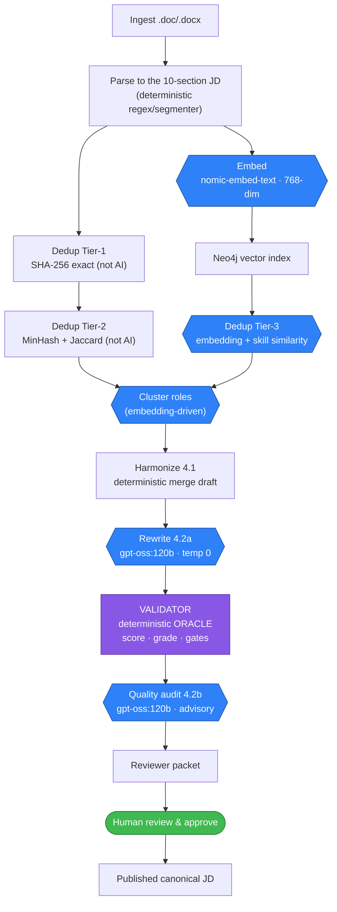
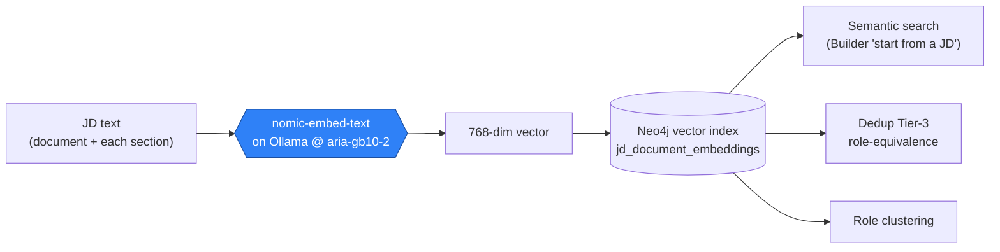
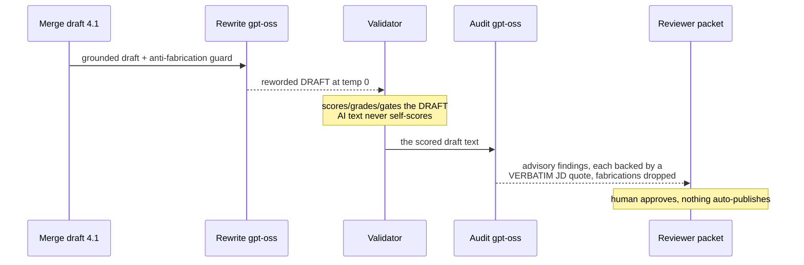
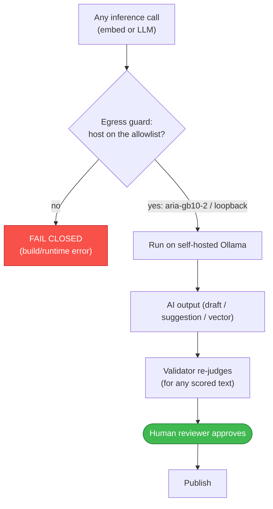

# AI in the JD Bank — where it's used, and the guardrails

**One-pager for:** anyone (HR, security, engineering) asking "where does this system use
AI, and can we trust it?" **Scope:** every place an LLM or an embedding model touches a job
description. **Sources of truth:** `embeddings.yaml`, `rewrite.yaml`, `quality.yaml`,
ADR-003 (inference topology), `src/jd_bank/security/egress.py`.

## The three rules AI operates under

1. **Self-hosted only (NN #5).** All inference runs on **Ollama on `aria-gb10-2`**, a
   trusted internal SFU host — never a cloud/third-party API. A build-enforced **egress
   guard** (`assert_inference_host_allowed`) fails closed on any other host, so JD content
   cannot leave to a vendor.
2. **The validator is the oracle (NN #3).** AI **never scores, grades, or approves** a JD.
   A deterministic rulebook validator does that, and it **re-judges every AI output**. AI
   only *drafts* and *suggests*.
3. **Human approval (NN #1).** Nothing an AI produces auto-publishes; an HR reviewer
   approves every canonical JD.

**Two AI modalities are used:** **embeddings** (for retrieval/dedup/clustering) and
**LLMs** (for three *advisory* text assists). Everything else — parsing, scoring, gates,
grade extraction, exact/near-duplicate detection — is **deterministic, not AI**.

---

## Where AI sits in the pipeline

**Blue = AI. Purple = the deterministic oracle. Green = the human gate.** Note the AI
rewrite (4.2a) is always followed by the validator (the oracle), and the audit (4.2b) is
advisory — it computes no score.

---

## The AI touchpoints, precisely

| # | AI use | Model (self-hosted) | Purpose | Judged by | Config / register |
|---|---|---|---|---|---|
| 1 | **Document + section embeddings** | `nomic-embed-text`, **768-dim** cosine | power semantic search, dedup Tier-3, and clustering | similarity only — **produces no score/decision** | `embeddings.yaml` (unhashed); `max_chars` backoff ladder **HR-193** |
| 2 | **Harmonization rewrite** (Phase 4.2a) | `gpt-oss:120b`, temp **0.0** | reword the deterministic 4.1 merge draft into cleaner prose | **the validator** (the draft is scored/graded after) | `rewrite.yaml` **HR-176…184**; `reasoning_effort` **HR-191** |
| 3 | **Quality audit** (Phase 4.2b) | `gpt-oss:120b`, temp **0.0** | nuanced *advisory* findings a regex can't judge: inclusive language · clarity · seniority-mismatch | **advisory** + a verbatim-evidence anti-fabrication scrub | `quality.yaml` **HR-185…190, 192** |
| 4 | **Summary-assist** (Builder, Phase 5.8b) | self-hosted LLM (`ChatClient`) | suggest a better Position Summary, **applied for the author to review** | the validator re-checks + the human decides | — |

**Not AI (deterministic):** the parser/segmenter, the validator/scoring/gates, dedup
Tier-1 (SHA-256) and Tier-2 (MinHash/Jaccard — an optional embedding *cosine confirm*
exists but ships **off**), and grade/classification extraction (regex).

---

## The embeddings subsystem

**Idempotent + deterministic:** the same text yields a byte-identical vector, so
embeddings are content-keyed on `text_sha256` (re-embedding is a skip). The dimension
`768` is asserted equal across the model, the Neo4j index, and the config. **No JD text is
stored in the vectors** beyond the model's numeric representation; the graph holds vectors
+ provenance stamps only (no grade, no PII).

---

## The two LLM passes (harmonization)

Key safeguards on these calls:
- **Anti-fabrication.** The rewrite runs under a grounding guard; the audit **drops any
  finding whose evidence quote is not found verbatim** in the JD.
- **Constrained decoding, where it's safe.** The **audit** uses schema-constrained JSON
  decoding (fixes an enum-mismatch failure); the **rewrite** intentionally does **not** —
  the large `SFUJobDescription` grammar 500s Ollama's structured-output builder, so it uses
  loose JSON mode with repair/retry.
- **Determinism.** Temperature `0.0` on both, so a re-run reproduces the same output — an
  audit trail is meaningful.
- **Separate models per pass.** `rewrite.model` and `quality.model` are distinct rulebook
  decisions, so re-tuning one can't silently move the other.

---

## The guardrails, as one picture

**Net:** AI in the JD Bank is confined to embeddings + three advisory LLM assists, all
self-hosted behind a fail-closed egress guard, all judged by a deterministic oracle, and
all gated by a human. Every AI knob is a registered HR decision (`open` until ratified);
none of them can change what the validator computes about a JD.
