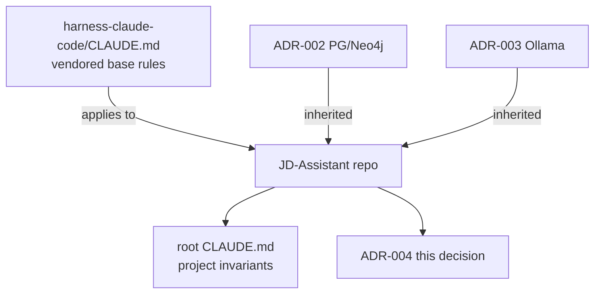

# ADR-004: JD Bank Repo Placement — Standalone Project Repo

**Status:** Accepted
**Date:** 2026-07-10

## Context

JD Bank is built under the v2 agent harness (Python-only: FastAPI, Postgres, Neo4j,
Redis/arq, Ollama). A placement decision was open: does the JD Bank codebase live *inside*
the harness mono-repo as a sub-folder, or as its own standalone repository that merely
*adopts* the harness conventions?

Two forces:

- The harness supplies real, inherited decisions (ADR-002 Postgres/Neo4j split, ADR-003
  offline Ollama) and enforced gates (ruff · black · mypy --strict · pytest · coverage ≥ 80%
  · branch-name). JD Bank must honour all of them.
- JD Bank is a distinct product with its own lifecycle, its own domain invariants (human
  approval, rulebook-as-data, FIPPA/local-first), and its own release cadence. Coupling it
  into the harness tree would entangle two lifecycles and blur ownership.

Path reconciliation (updated 2026-07-10): earlier session notes referenced the repo as
`C:\repos\jdbank` and the harness as `C:\repos\agent-harnesses-v2`.
- **`C:\repos\agent-harnesses-v2` — LIVE.** This is the authoritative **upstream harness**
  (regenerated in full by Fable 5). `C:\repos\JD-Assistant` vendors a copy of it under
  `core/`, `harness-claude-code/`, `harness-codex/`, `harness-copilot/`. (An earlier draft
  of this ADR wrongly stated this path did not exist — corrected here.)
- **`C:\repos\jdbank` — STALE.** An abandoned v1-TypeScript attempt; not the project repo.
- **`C:\repos\JD-Assistant` — the live project repo** (this one).

The vendored harness copy in this repo was initially an **incomplete snapshot** — it was
missing the harness **subagents subsystem** (`core/src/agents/{base,orchestrator,planner,
docs,reviewer,security,tester}.py`, the `run_pipeline` worker, `.claude/agents/*`, and the
subagent skill files). It was **reconciled from upstream `agent-harnesses-v2` on 2026-07-10**
(deliberate vendored-copy sync, per the alternatives below).

## Decision

JD Bank is a **standalone project repository** at `C:\repos\JD-Assistant`. It **adopts** the
v2 harness conventions (gates, docker-compose stack, git workflow, TDD order, code rules)
without being a sub-folder of any harness mono-repo.

- The authoritative base harness rules are vendored in-repo at
  `harness-claude-code/CLAUDE.md`; they apply here in full.
- Inherited ADRs 002 (Postgres/Neo4j split) and 003 (offline Ollama) are **not re-opened**.
  JD Bank ADRs begin at 004.
- The root `CLAUDE.md` is the project's own invariant sheet (installed in Phase 0 task 0.5);
  it references — and does not contradict — the vendored harness rules.
- `C:\repos\agent-harnesses-v2` is the **live upstream harness** this repo syncs from;
  `C:\repos\jdbank` is the only stale path (abandoned v1 attempt).

## Consequences

- Independent lifecycle, versioning, and release cadence for JD Bank.
- Harness code + rules are consumed as a vendored copy synced deliberately from upstream
  `C:\repos\agent-harnesses-v2` — a reviewed sync rather than implicit inheritance. The
  2026-07-10 subagents reconciliation is the first such sync; future upstream changes follow
  the same pattern. **Sync drift is now a standing maintenance concern** — record the upstream
  commit/snapshot each sync so the vendored copy's provenance is auditable.
- Session bootstraps point at `C:\repos\JD-Assistant` (project) and may read
  `C:\repos\agent-harnesses-v2` (upstream harness). Only the stale `jdbank` path should be
  scrubbed from HANDOFF/docs on a chore branch.

## Alternatives Considered

- **Sub-folder of the harness mono-repo**: simplest rule inheritance, but entangles two
  product lifecycles and muddies ownership/CI boundaries; rejected.
- **Git submodule of the harness into JD Bank**: keeps rules in sync automatically, but
  submodules add operational friction and surprise for contributors, and make offline work
  fragile; rejected in favour of a vendored copy synced deliberately.
